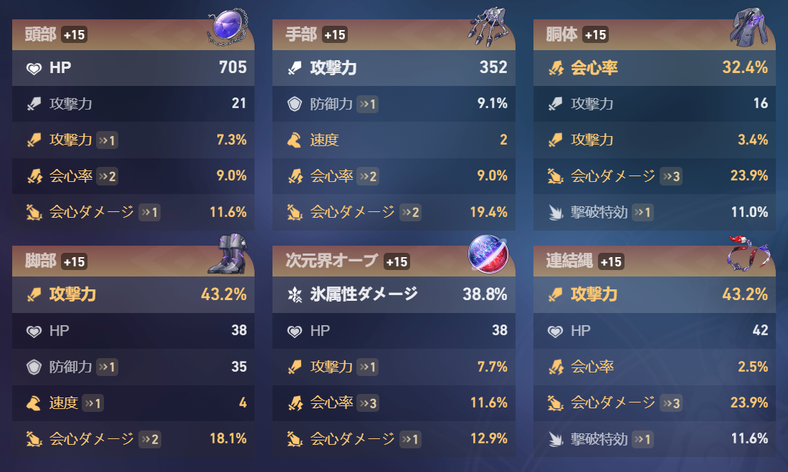
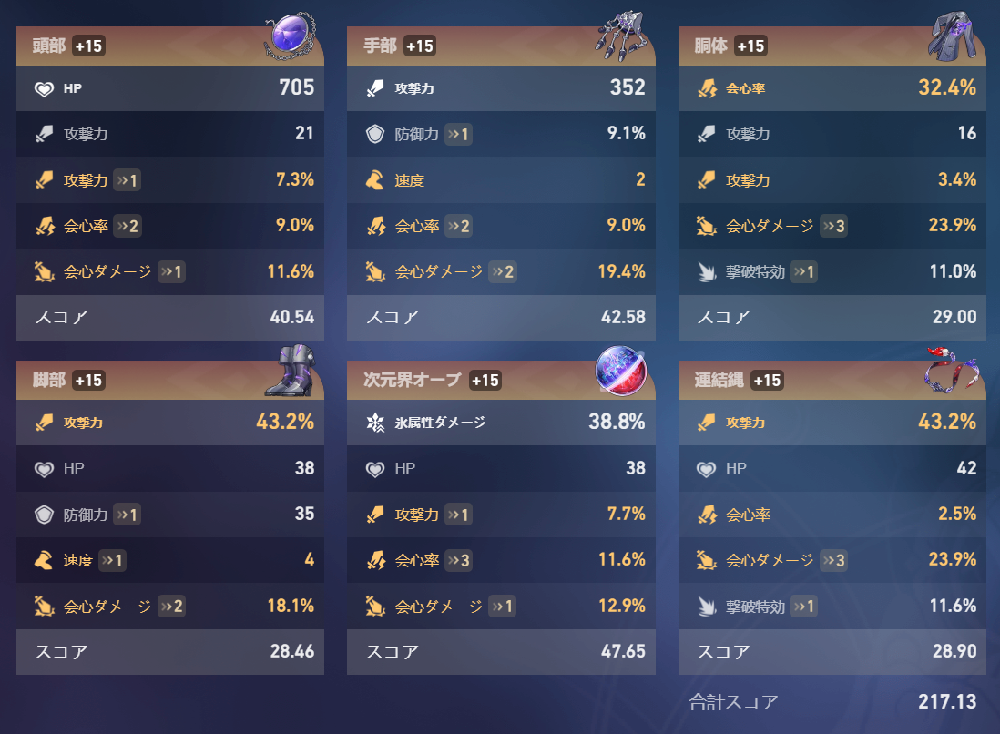

# スコア計算 Chrome拡張

このChrome拡張は[崩壊：スターレイル（戦績）](https://act.hoyolab.com/app/community-game-records-sea/rpg/index.html) 上でスコア計算を行い、その結果をページに追加する機能を提供します。

## 特徴

- **厳密なスコア計算**：普及したスコア計算方式（※1）ではなく、正確な計算方式（※2）を使用して結果を算出します。  
<small>※1 会心ダメージ : 会心率 : 攻撃力%（HP%) = 1 : 2 : 1 </small>  
<small>※2 会心ダメージ : 会心率 : 攻撃力%（HP%) = 1 : 2 : 1.5</small>  

- **汎用性**：公式ページ内の「カスタムサブステータス」から選んだ「有効サブステータス」を加点対象とするため、HPアタッカー、サポーターなど、全てのキャラクターで利用することができます。

- **結果表示**：計算結果は [崩壊：スターレイル（戦績）](https://act.hoyolab.com/app/community-game-records-sea/rpg/index.html) 上に表示されます。

   <figure>
      <figcaption><small>導入前のイメージ</small></figcaption>
      
   </figure>
   <figure>
      <figcaption><small>導入後のイメージ</small></figcaption>
      
   </figure>

- **Chrome拡張として動作**：Chromeブラウザで動作する拡張機能です。

## 導入方法

### GitHubからダウンロード

1. GitHub から拡張機能をダウンロードします。
   - リポジトリページ: `https://github.com/kimura-aruku/StarRailExtension`
   - **[Download ZIP](https://github.com/kimura-aruku/StarRailExtension/archive/main.zip)** ボタンをクリックし、拡張機能のソースコードをダウンロードします。

2. ダウンロードした ZIP ファイルを解凍し、その中のフォルダを任意の場所に保存します。

3. Chrome ブラウザを開き、アドレスバーに `chrome://extensions` と入力して拡張機能の管理ページを開きます。

4. ページ右上の **「デベロッパーモード」** をオンにします。

5. **「パッケージ化されていない拡張機能を読み込む」** ボタンをクリックし、解凍した拡張機能のフォルダを選択します。

6. インストールが完了すると、Chromeに拡張機能が追加されます。

## 使用方法

1. [崩壊：スターレイル（戦績）](https://act.hoyolab.com/app/community-game-records-sea/rpg/index.html) にアクセスします。

2. 拡張機能が自動的にページのスコアを計算し、結果を画面上に表示します。

3. 戦績画面上の数値を使用するため、速度は小数点以下の値は加味されません。

## 注意

- この拡張機能は、[崩壊：スターレイル（戦績）](https://act.hoyolab.com/app/community-game-records-sea/rpg/index.html)のみで動作します。他のウェブサイトでは動作しません。

- スコア計算は普及された計算方法とは異なるため、他サイトとは異なる結果になることがあります。

## 今後追加予定の機能

- 日本語以外の言語に対応する。
